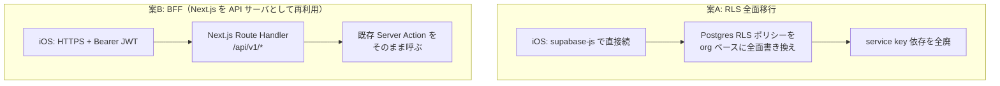
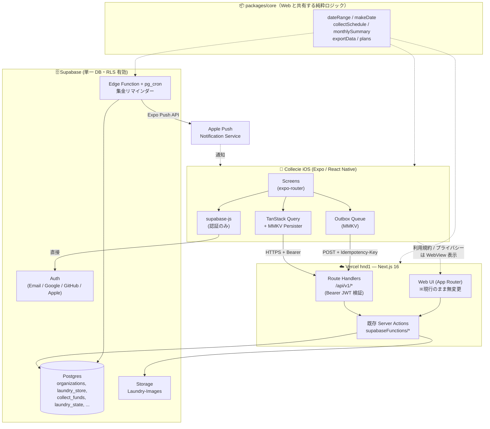
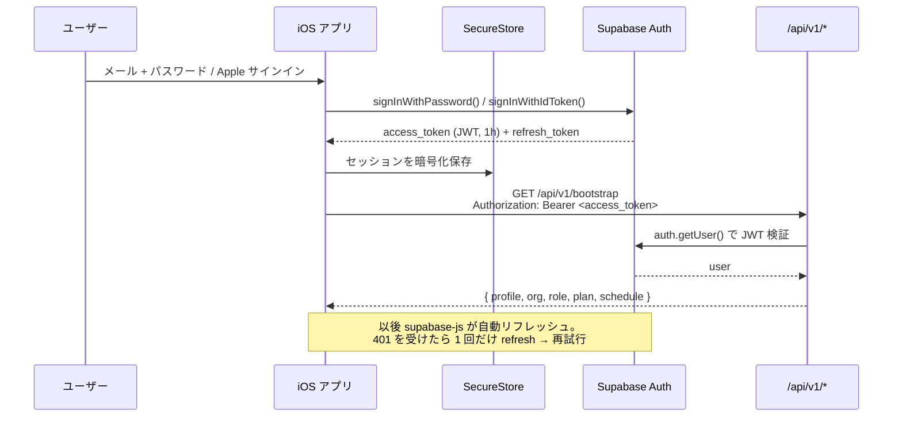
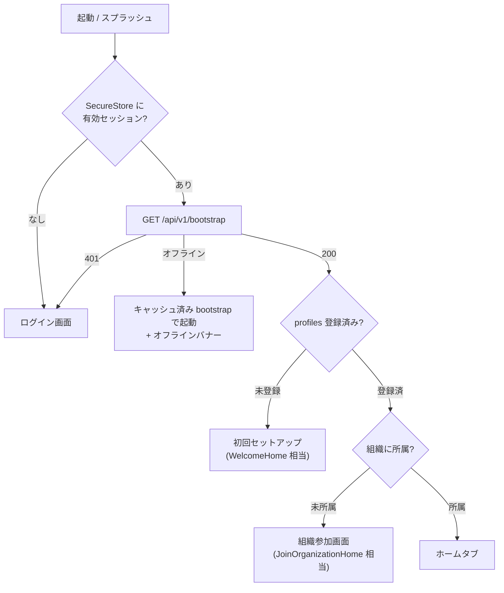
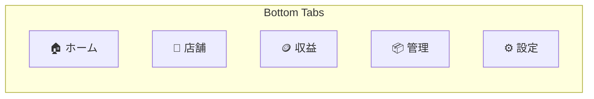
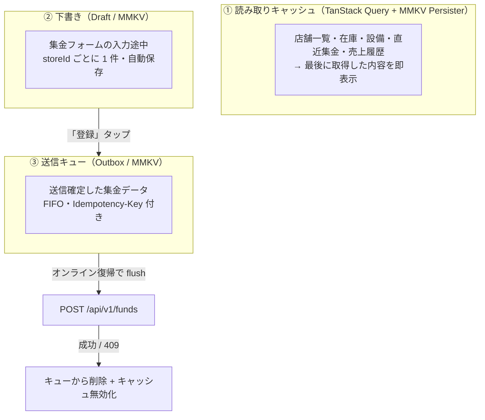
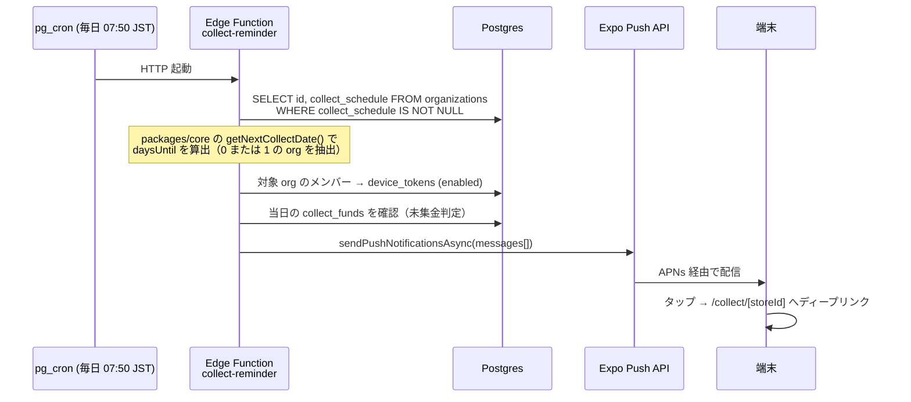

# Collecie iOS 設計図

> 対象: コインランドリー集金アプリ「Collecie」の iOS ネイティブアプリ版
> 前提: **DB は現行 Supabase をそのまま共有**（スキーマ変更は追加のみ）
> 方式: **React Native / Expo**、**アプリ内課金なし（プラン表示は read-only）**
> 作成日: 2026-07-27

---

## 目次

1. [ゴールとスコープ](#1-ゴールとスコープ)
2. [最重要論点：認可ロジックをどこに置くか](#2-最重要論点認可ロジックをどこに置くか)
3. [全体アーキテクチャ](#3-全体アーキテクチャ)
4. [リポジトリ構成](#4-リポジトリ構成)
5. [認証・セッション設計](#5-認証セッション設計)
6. [API 層設計（BFF）](#6-api-層設計bff)
7. [画面設計](#7-画面設計)
8. [データモデルと追加スキーマ](#8-データモデルと追加スキーマ)
9. [オフライン設計](#9-オフライン設計)
10. [プッシュ通知設計](#10-プッシュ通知設計)
11. [デザインシステムの移植](#11-デザインシステムの移植)
12. [ライブラリ選定](#12-ライブラリ選定)
13. [App Store 審査対応](#13-app-store-審査対応)
14. [実装フェーズ](#14-実装フェーズ)
15. [リスクと未決事項](#15-リスクと未決事項)

---

## 1. ゴールとスコープ

### なぜネイティブアプリを出すのか

現行は PWA 対応済み（`public/manifest.json`）だが、**現場業務で PWA が構造的に解けない問題**が 3 つある。iOS 版はこれを解くことを目的とする。

| # | 現場の課題 | PWA での限界 | ネイティブで解けること |
|---|---|---|---|
| 1 | コインランドリーは地下・鉄筋屋内が多く電波が弱い | Service Worker のキャッシュのみ。POST の再送キューがない | **送信キュー（Outbox）** で圏外入力 → 復帰時に自動送信 |
| 2 | 集金日を忘れる（`今後の実装予定 3` の未実装項目） | iOS Safari の Web Push は制約が多く実運用に耐えない | **APNs 経由の確実なリマインダー通知** |
| 3 | 片手・グローブ操作での金額入力 | ブラウザ UI（アドレスバー・戻る）が邪魔をする | 全画面 + ハプティクス + カスタム数値キーパッド |

### スコープ

**入れる（v1）**

- 集金データの登録・編集・削除・閲覧（アプリの中核）
- 店舗一覧・詳細・売上履歴・グラフ
- 在庫管理 / 設備故障状況の閲覧・更新
- ホーム（当月合計・直近集金・低在庫/故障サマリー・集金カウントダウン）
- 設定（プロフィール・組織メンバー管理・集金スケジュール・**プラン表示のみ**）
- オフライン下書き + 送信キュー
- 集金リマインダー通知

**入れない（v1 では Web に誘導せず、単に機能を出さない）**

- プラン変更・決済（→ [13章](#13-app-store-審査対応) 参照。**Web への導線も置かない**）
- 未ログイン LP（`NotLoginUserHome`）— アプリは起動即ログイン画面
- 利用規約・プライバシーポリシー・特商法ページ — アプリ内 `WKWebView` で該当 URL を表示するだけ
- CSV / Excel エクスポート — v1.1 送り（サーバ生成 + 共有シート、[6.7](#67-エクスポート) に設計だけ記載）

---

## 2. 最重要論点：認可ロジックをどこに置くか

**この判断が iOS 版の設計全体を決める。** 先に結論と根拠を書く。

### 現状の構造

現行 Web アプリは「**RLS は最終防衛線、認可はアプリ層（Server Action）で行う**」という方針（`CLAUDE.md` セキュリティ節）。実際のコードもその通りになっている：

```js
// src/app/api/supabaseFunctions/supabaseDatabase/laundryStore/action.js:20-41
export const getStores = cache(async () => {
  const { user } = await getUser();
  if (!user) return { error: { msg: "ログインしてください", status: 401 } };

  const supabase = await createClient();
  const { orgId } = await getMyOrgId(supabase, user.id);   // ← ①組織境界をアプリ層で確認
  if (!orgId) return { data: [] };

  // 組織メンバーであることを確認後、RLSを迂回して取得（閲覧者も参照可能にする）
  const serviceSupabase = createServiceClient();           // ← ②RLS を完全バイパス
  const { data, error } = await serviceSupabase
    .from("laundry_store").select("*").eq("organization_id", orgId);
  ...
});
```

コメントが明言している通り、**現行の RLS ポリシーだけでは `viewer` / `collecter` は組織の店舗を読めない**。だから `createServiceClient()`（`SUPABASE_SERVICE_KEY`）で迂回している。この構造は `collect_funds` / `laundry_state` / `organizations` の全アクションで同様。

### したがって選択肢は 2 つしかない



| 観点 | 案A: RLS 全面移行 | 案B: BFF |
|---|---|---|
| 認可ロジックの重複 | なし（DB に一元化）| なし（既存関数を再利用）|
| 初期工数 | **大**。約 7 テーブル分のポリシー再設計 + 全 Web 画面の回帰テスト | **小**。`createClient()` 1 ファイル改修 + 薄い Route Handler |
| セキュリティ事故リスク | **高**。移行途中に穴が開くと本番 Web も同時に壊れる | 低。既存の検証済みロジックを一切変えない |
| レイテンシ | 低（端末 → Supabase 直）| +1 ホップ（端末 → Vercel hnd1 → Supabase）|
| Supabase Realtime | 使える | 使えない（別途 WebSocket 設計が必要）|
| 将来の Android 版 | そのまま流用可 | そのまま流用可 |

### 結論：**案B（BFF）を採用する**

理由は 3 点。

1. **認可ロジックを二重に持たない。** 案A は「RLS 版の認可」と「Server Action 版の認可」が一時的に併存し、片方だけ直す事故が必ず起きる。本アプリは金額データを扱うため、この種の分岐は許容できない。
2. **既存の防御が一切劣化しない。** `updateData()` の「admin 以外は `collecter = 自分` に限定」のような細かい規則（`collectFunds/action.js:236-238`）を RLS に翻訳するのは可能だが、翻訳ミスの検出が難しい。
3. **レイテンシのペナルティが実質ない。** `vercel.json` は既に `"regions": ["hnd1"]`（東京）で、Supabase も同リージョン想定。1 ホップの追加は数十 ms。集金入力は 1 画面 1 送信のワークロードなので体感差は出ない。

> **将来 Realtime（他メンバーの集金をリアルタイム反映）を入れたくなった時点で、案A への移行を再検討する。** その場合も BFF は残し、読み取りだけ RLS 経由に寄せるハイブリッドが取れる。

### 案B を成立させる唯一の改修点

既存 Server Action は `getUser()` → `createClient()` 経由で **Cookie からセッションを読む**。モバイルは Cookie を持たず Bearer JWT を送る。ここだけを吸収する。

```js
// src/utils/supabase/server.js を改修（この 1 ファイルだけ）
import { createServerClient } from "@supabase/ssr";
import { createClient as createSupabaseClient } from "@supabase/supabase-js";
import { cookies, headers } from "next/headers.js";

export async function createClient() {
  // ① モバイルからの Bearer トークンを優先
  const h = await headers();
  const authz = h.get("authorization");
  if (authz?.startsWith("Bearer ")) {
    return createSupabaseClient(
      process.env.NEXT_PUBLIC_SUPABASE_URL,
      process.env.NEXT_PUBLIC_SUPABASE_ANON_KEY,
      { global: { headers: { Authorization: authz } },
        auth: { persistSession: false, autoRefreshToken: false } }
    );
  }

  // ② 従来どおり Cookie ベース（Web は完全に無変更）
  const cookieStore = await cookies();
  return createServerClient(/* ...現行のまま... */);
}
```

これだけで `getUser()`・`getMyOrgId()`・ロール判定・RLS スコープのクエリが**すべてモバイルでも同じ意味で動く**。`createServiceClient()` は元々セッション非依存なので影響なし。

- ✅ Web 側の挙動は 1 ミリも変わらない（Authorization ヘッダは飛んでこない）
- ✅ Server Action は `"use server"` の async 関数なので、Route Handler から**直接 import して呼べる**（プロセス内関数呼び出し。HTTP は経由しない）

---

## 3. 全体アーキテクチャ



### 各層の責務

| 層 | 責務 | 禁止事項 |
|---|---|---|
| **iOS アプリ** | 表示・入力・オフライン保持・通知受信 | 認可判定を信じない（UI 制御のためだけにロールを使う）。`SUPABASE_SERVICE_KEY` を絶対に持たない |
| **packages/core** | 日付・集計・スケジュール計算などの純粋関数 | DB / React / Node API への依存 |
| **Route Handler** | JWT 検証・入出力の JSON 整形・冪等性制御 | ビジネスロジックを書かない（Server Action に委譲）|
| **Server Action** | 認証・認可・DB 操作（**唯一の正**）| — |
| **RLS** | 最終防衛線 | ここだけに頼らない |

---

## 4. リポジトリ構成

現行リポジトリを **npm workspaces のモノレポ**に変換し、Web とアプリで純粋ロジックを共有する。

```
coin-laundry-app/
├── package.json                 # workspaces: ["apps/*", "packages/*"]
├── apps/
│   ├── web/                     # ← 現行 src/ をここへ移設（中身は無変更）
│   │   ├── src/app/
│   │   │   ├── api/v1/          # ★新規: モバイル向け Route Handlers
│   │   │   └── ...              # 既存ページ
│   │   ├── next.config.mjs
│   │   └── vercel.json          # regions: ["hnd1"]
│   └── mobile/                  # ★新規: Expo アプリ
│       ├── app/                 # expo-router（ファイルベースルーティング）
│       ├── src/
│       │   ├── api/             # BFF クライアント（fetch ラッパー）
│       │   ├── components/      # 汎用 UI（Card, Button, MoneyText …）
│       │   ├── features/        # 機能別（web の feacher/ と対応させる）
│       │   ├── theme/           # デザイントークン（globals.css の移植）
│       │   ├── offline/         # Outbox / Draft ストア
│       │   └── hooks/
│       ├── app.json
│       └── eas.json
└── packages/
    └── core/                    # ★新規: 現行 src/functions/ を移設
        ├── src/
        │   ├── dateRange.js         # applyDateRange / END_INCLUSIVE
        │   ├── makeDate/date.js     # getEpochTimeInSeconds ほか
        │   ├── collectSchedule.js   # getNextCollectDate
        │   ├── monthlySummary.js
        │   ├── exportData.js
        │   ├── csvExport.js
        │   ├── xlsxExport.js        # ※Web/サーバ専用（RN からは import しない）
        │   └── plans.js             # PLAN_LIMITS / PLAN_NAMES
        └── *.test.js                # 既存 Vitest がそのまま動く
```

### 移設方針

- `src/functions/` 配下は **すべて DB / React 非依存の純粋関数**（`CLAUDE.md` テスト節の方針どおり）なので、そのまま `packages/core` へ移せる。既存の Vitest スイート（`dateRange.test.js` ほか）も無改修で通る。
- `xlsxExport.js` は `write-excel-file/node` に依存するサーバ専用。`packages/core` に置くがサブパス export を分け、RN バンドルに載らないようにする。
- Web 側の import は `@/functions/...` → `@collecie/core/...` に一括置換。`apps/web/jsconfig.json` の `paths` は維持。

> **移設のリスクを避けたい場合の代替案**: モノレポ化せず、`packages/core` 相当を `apps/mobile` から相対パス (`../../src/functions`) で参照し、Metro の `watchFolders` に追加する手もある。ただし依存の重複解決でハマりやすいため、workspaces を推奨。

---

## 5. 認証・セッション設計

### 方式

**認証だけは端末から Supabase Auth へ直接**行う（BFF を挟まない）。取得した `access_token` を以降 BFF への Bearer として使う。



### 保存先の注意点

`expo-secure-store` は **1 項目あたり 2048 バイト制限**があり、Supabase のセッション JSON（access_token + refresh_token + user）は環境によりこれを超える。素直に `SecureStore` を `storage` に渡すと **サイレントに保存失敗してログアウトを繰り返す**。

対策：**チャンク分割アダプタ**を実装する。

```ts
// apps/mobile/src/api/secureStorage.ts
const CHUNK = 1800;
export const LargeSecureStore = {
  async setItem(key: string, value: string) {
    const parts = value.match(new RegExp(`.{1,${CHUNK}}`, "g")) ?? [];
    await SecureStore.setItemAsync(`${key}_n`, String(parts.length));
    await Promise.all(parts.map((p, i) => SecureStore.setItemAsync(`${key}_${i}`, p)));
  },
  async getItem(key: string) { /* _n を読んで結合 */ },
  async removeItem(key: string) { /* 全チャンク削除 */ },
};
```

```ts
createClient(URL, ANON_KEY, {
  auth: {
    storage: LargeSecureStore,
    autoRefreshToken: true,
    persistSession: true,
    detectSessionInUrl: false,   // ← RN では必ず false
  },
});
```

さらに `AppState` の `active` / `background` で `supabase.auth.startAutoRefresh()` / `stopAutoRefresh()` を切り替える（バックグラウンドでの無駄なリフレッシュを防ぐ）。

### サインイン手段

| 手段 | 実装 | 備考 |
|---|---|---|
| メール + パスワード | `signInWithPassword` | Web と同じバリデーション（8文字以上・英数字混在）を `packages/core` に切り出して共有 |
| **Sign in with Apple** | `expo-apple-authentication` → `signInWithIdToken({ provider: "apple" })` | **App Store 審査で必須**（[13章](#13-app-store-審査対応)）|
| Google | `expo-auth-session` → `signInWithIdToken({ provider: "google" })` | ネイティブフローを使う。`signInWithOAuth` + WebView は審査で嫌われる |
| GitHub | v1 では非対応 | 現場ユーザー層で利用が薄いため。Web には残す |
| パスワードリセット | `resetPasswordForEmail` + Universal Links | `collecie://auth/reset` ではなく Universal Link 推奨 |

### 起動時フロー



分岐条件は現行 `src/app/page.js:110-124` の判定ロジックと 1 対 1 で対応させる。

---

## 6. API 層設計（BFF）

### 6.1 共通仕様

| 項目 | 仕様 |
|---|---|
| ベース URL | `https://www.collecie.com/api/v1` |
| 認証 | `Authorization: Bearer <supabase access_token>`（全エンドポイント必須）|
| Content-Type | `application/json`（画像アップロードのみ `multipart/form-data`）|
| 成功レスポンス | `{ "data": ... }` |
| エラーレスポンス | `{ "error": { "message": "日本語メッセージ", "code": "FORBIDDEN" } }` |
| クライアントバージョン | `X-Client-Version: ios/1.0.0` → 将来の強制アップデート判定に使う |
| 冪等性 | 書き込み系は `Idempotency-Key: <uuid v4>` を必須化 |

### 6.2 共通ラッパー

Route Handler は薄く保つ。認可は既存 Server Action が持っているので、ここでは JWT 検証と整形だけ行う。

```js
// apps/web/src/app/api/v1/_lib/handler.js
import { NextResponse } from "next/server";
import { getUser } from "@/app/api/supabaseFunctions/supabaseDatabase/user/action";

export function withAuth(fn) {
  return async (req, ctx) => {
    const { user } = await getUser();          // ← Bearer を server.js が解決済み
    if (!user) return NextResponse.json(
      { error: { message: "ログインしてください", code: "UNAUTHENTICATED" } },
      { status: 401 }
    );
    try {
      const { data, error, status } = await fn(req, ctx, user);
      if (error) return NextResponse.json(
        { error: { message: typeof error === "string" ? error : error.msg } },
        { status: status ?? (typeof error === "object" && error.status) ?? 400 }
      );
      return NextResponse.json({ data });
    } catch (e) {
      console.error(e);
      return NextResponse.json(
        { error: { message: "予期しないエラーが発生しました" } }, { status: 500 }
      );
    }
  };
}
```

### 6.3 エンドポイント一覧

凡例: 🔒 = admin 限定 / ✍️ = viewer 不可（admin・collecter のみ）

#### 起動・ホーム

| Method | Path | 委譲先 Server Action | 備考 |
|---|---|---|---|
| GET | `/bootstrap` | `getUser` + `getProfile` + `getMyOrganization` + `getOrgPlan` + `getCollectSchedule` | 起動時 1 リクエストに集約。`Promise.all` で並列化 |
| GET | `/home` | `getMonthFunds` + `getRecentCollectFunds` + `getStockStates` + `getMachinesStates` | 同上。低在庫・故障の件数だけ返し、詳細は各タブで取得 |

#### 店舗

| Method | Path | 委譲先 | |
|---|---|---|---|
| GET | `/stores` | `getStores()` | |
| GET | `/stores/:id` | `getStore(id)` | |
| POST | `/stores` | `createStore(formData)` | 🔒 プラン上限チェックは Server Action 内で実施済み |
| PATCH | `/stores/:id` | `updateStore(formData, id)` | 🔒 機種の増減 → `laundry_state.machines` 同期も既存ロジックが担う |
| DELETE | `/stores/:id` | `deleteStore(id)` | 🔒 |
| POST | `/stores/images` | `uploadStoreImage(formData)` | 🔒 `multipart/form-data` |
| DELETE | `/stores/images` | `deleteStoreImage(path)` | 🔒 |

#### 集金データ（アプリの中核）

| Method | Path | 委譲先 | |
|---|---|---|---|
| GET | `/funds?storeId&offset&limit&order&asc` | `getStoreFundsPaginated` / `getOrgCollectFundsPaginated` | `storeId` 有無で分岐 |
| GET | `/funds?storeId&from&to&order&asc` | `getStoreFundsInPeriod` / `getOrgCollectFundsInPeriod` | 期間指定時 |
| GET | `/funds/:id` | `getFundItemById(id)` | 明細（`fundsArray`）の遅延取得 |
| POST | `/funds` | `createData(formData)` | ✍️ **`Idempotency-Key` 必須**（[6.4](#64-冪等性の設計)）|
| PATCH | `/funds/:id` | `updateData` / `updateDate` | ✍️ body に `fundsArray`/`totalFunds` or `date` |
| DELETE | `/funds/:id` | `deleteData(id)` | ✍️ |
| GET | `/funds/chart?storeId&from&to` | `getStoreFundsForChart` / `getOrgCollectFunds` | グラフ用（軽量カラムのみ）|
| GET | `/funds/summary/monthly?storeId` | `getCollectMonthlySummary` | 前月比・前年同月比 |
| GET | `/funds/summary/stores` | `getStoreRevenueSummary` | 店舗別累計 |

#### 在庫・設備

| Method | Path | 委譲先 | |
|---|---|---|---|
| GET | `/states` | `getAllLaundryStates()` | |
| GET | `/states/:laundryId` | `getLaundryState(laundryId)` | |
| PATCH | `/states/:laundryId/machines` | `updateMachinesState` | ✍️ |
| PATCH | `/states/:laundryId/stock` | `updateStockState` | ✍️ `extra_stocks` / `stock_thresholds` 含む |

#### 組織・メンバー

| Method | Path | 委譲先 | |
|---|---|---|---|
| POST | `/org` | `createOrganization(name)` | |
| PATCH | `/org` | `updateOrganizationName(name)` | 🔒 |
| POST | `/org/join` | `requestJoinOrg(adminEmail, password)` | 組織参加 |
| GET | `/org/members` | `getOrganizationMembers()` | |
| PATCH | `/org/members/:userId` | `updateMemberRole(userId, role)` | 🔒 |
| DELETE | `/org/members/:userId` | `removeMember(userId)` | 🔒 |
| GET/POST/DELETE | `/org/invitations[/:id]` | `getOrganizationInvitations` / `inviteMember` / `deleteInvitation` | 🔒 |
| GET/PUT | `/org/collect-schedule` | `getCollectSchedule` / `updateCollectSchedule` | PUT は 🔒 |
| GET/PUT | `/org/join-password` | `getOrgJoinPassword` / `setOrgJoinPassword` | 🔒 |
| GET | `/org/messages` | `getOrgMessages(orgId)` | 操作ログ |

#### アカウント・プラン

| Method | Path | 委譲先 | |
|---|---|---|---|
| GET/PATCH | `/profile` | `getProfile` / `updateProfile` / `setCollectMethod` | |
| POST | `/profile/avatar` | `uploadAndSetAvatar(formData)` | |
| GET | `/plan` | `getOrgPlan()` | **read-only**。checkout / portal は生やさない |
| POST | `/devices` | ★新規 | プッシュトークン登録 |
| DELETE | `/devices/:token` | ★新規 | ログアウト時に解除 |
| DELETE | `/account` | ★新規 | **App Store 5.1.1(v) 対応**（[13章](#13-app-store-審査対応)）|

### 6.4 冪等性の設計

**これは必須。** 現行の集金登録はこうなっている：

```js
// src/app/feacher/dialog/CheckDialogCollectMoney.jsx:66
date: epoc + Math.floor(Math.random() * 1000),
```

`date` にランダムなジッターを足しているため、**同じ入力を 2 回送ると別レコードとして 2 件入る**。オフライン送信キューは「送信したがレスポンスを受け取れなかった」ケースで必ず再送するので、このままでは**集金額の二重計上**が起きる。

対策：

```sql
ALTER TABLE public.collect_funds ADD COLUMN IF NOT EXISTS client_request_id text;
CREATE UNIQUE INDEX IF NOT EXISTS collect_funds_client_request_id_uniq
  ON public.collect_funds (client_request_id)
  WHERE client_request_id IS NOT NULL;
```

- 端末は集金フォームを開いた時点で `uuid v4` を 1 個生成し、下書き・Outbox とともに保持する
- `POST /funds` は `Idempotency-Key` ヘッダをそのまま `client_request_id` に入れて INSERT
- 一意制約違反（`23505`）は **成功扱い**にして既存レコードを返す
- Web 側は `client_request_id = NULL` のままなので影響なし（部分ユニークインデックス）

> 併せて `date` のランダムジッターは廃止候補。ジッターがあると同日 2 回集金の並び順が不定になり、`packages/core` の月次集計とも噛み合わない。ただし既存データとの互換があるため **v1 では触らず、iOS からの新規レコードのみジッターなしで送る**（`applyDateRange` は `gte`/`lt` なので日境界の判定には影響しない）。

### 6.5 レート制限とバージョン管理

- `POST /funds` は端末あたり 60 req/min で十分。Vercel の WAF ルールで足りる
- `X-Client-Version` を見て、サポート切れバージョンには `426 Upgrade Required` + `{ error: { code: "UPGRADE_REQUIRED" } }` を返し、アプリは強制アップデート画面を出す

### 6.6 エラーコード

| code | HTTP | アプリ側の挙動 |
|---|---|---|
| `UNAUTHENTICATED` | 401 | セッション更新を 1 回試行 → 失敗ならログイン画面 |
| `FORBIDDEN` | 403 | トーストで理由表示。画面は維持 |
| `NO_ORG` | 403 | 組織参加画面へ |
| `PLAN_LIMIT` | 403 | 「店舗を追加できません」のみ表示（**アップグレード導線は出さない**）|
| `UPGRADE_REQUIRED` | 426 | 強制アップデート画面 |
| `CONFLICT` | 409 | Outbox は成功扱いで破棄 |

### 6.7 エクスポート

v1.1 で実装。**CSV も Excel もサーバ生成に統一**する（RN では `write-excel-file` を動かせず、CSV もクライアント生成する利点がないため）。

```
POST /api/v1/export/xlsx   → 既存 /api/export/collect-xlsx を Bearer 対応させて流用
POST /api/v1/export/csv    → 新規（packages/core の csvExport をサーバ側で使う）
```

アプリ側は `expo-file-system` の `downloadAsync` で保存 → `expo-sharing` で共有シートを開く。
Pro プラン未満は現行どおり 403 を返し、アプリは「Pro プラン以上の機能です」とだけ表示する（**課金導線は置かない**）。

---

## 7. 画面設計

### 7.1 ナビゲーション

現行の `FooterNavbar`（`ALL_NAV_ITEMS`）と同一のタブ構成にする。Web とアプリで「同じ場所に同じものがある」状態を保つため。



組織未所属ユーザーは `RESTRICTED_NAV_ITEMS` と同じく **ホーム / 設定の 2 タブのみ**表示（`FooterNavber.jsx` の `hasOrg` 分岐に対応）。

### 7.2 ルート構成（expo-router）

```
app/
├── _layout.tsx                       # Providers（Query, Theme, Auth, Outbox）
├── (auth)/
│   ├── login.tsx
│   ├── signup.tsx
│   ├── forgot-password.tsx
│   └── setup.tsx                     # 初回プロフィール登録（WelcomeHome 相当）
├── (app)/
│   ├── _layout.tsx                   # Tabs
│   ├── index.tsx                     # 🏠 ホーム
│   ├── stores/
│   │   ├── index.tsx                 # 🧺 店舗一覧
│   │   ├── new.tsx                   # 🔒 店舗登録
│   │   └── [id]/
│   │       ├── index.tsx             # 店舗詳細
│   │       ├── edit.tsx              # 🔒 店舗編集
│   │       └── history.tsx           # 売上履歴 + グラフ
│   ├── revenue/
│   │   └── index.tsx                 # 🪙 収益（org 全体）
│   ├── manage/
│   │   └── index.tsx                 # 📦 在庫 / 設備（セグメント切替）
│   └── settings/
│       ├── index.tsx                 # ⚙️ 設定
│       ├── account.tsx
│       ├── organization.tsx          # 🔒 メンバー・招待・参加パスワード
│       ├── collect-schedule.tsx      # 🔒
│       ├── notifications.tsx         # ★アプリ固有：通知設定
│       ├── plan.tsx                  # read-only
│       ├── log.tsx
│       └── webview.tsx               # 利用規約 / プライバシー / 特商法
└── collect/
    └── [storeId].tsx                 # 💰 集金入力（フルスクリーンモーダル）
```

### 7.3 画面別マッピングと変更点

| iOS 画面 | 対応する Web | 主な差分 |
|---|---|---|
| ホーム | `LoginUserHome` | Pull-to-refresh 追加。集金カウントダウンをヘッダ常設。オフライン時はキャッシュ表示 + バナー |
| 店舗一覧 | `/coinLaundry` | 画像カルーセルは `expo-image` + `FlashList` |
| 店舗詳細 | `/coinLaundry/[id]` | 電話・地図アプリ起動（`Linking`）を追加 |
| 売上履歴 | `/coinLaundry/[id]/coinDataList` | 無限スクロール（`useInfiniteQuery`）。テーブルは `FlashList` |
| 収益 | `/collectMoney` | 期間セグメント + 店舗別累計 + 月次サマリー。エクスポートは v1.1 |
| 管理 | `/inventory` + `/equipment` | Web では 2 ページだが、Footer 上は同じ「管理」タブ。**アプリではセグメントコントロールで統合**（`isActive` が両方を同一タブ扱いしている現行仕様に合わせる）|
| **集金入力** | `/collectMoney/[id]/newData` | **最も作り込む画面**。[7.4](#74-集金入力画面) 参照 |
| 設定 | `/settings` | プランカードは read-only。「その他」に規約類（WebView）|

### 7.4 集金入力画面

現場での実使用が集中する画面。ネイティブの利点をここに全振りする。

```
┌─────────────────────────────────┐
│ ✕            ○○店            ⋯ │  ヘッダ（店舗切替可）
├─────────────────────────────────┤
│ 📅 集金日      2026/07/27    ▾ │  ネイティブ DatePicker（JST 0時に正規化）
├─────────────────────────────────┤
│ 集金方式   [ 機種別 | 合計 ]     │  profiles.collectMethod を初期値に
├─────────────────────────────────┤
│ 洗濯機A          [    12 ]枚  ⚖ │  ← ⚖ タップで重量入力に切替
│ 乾燥機B          [     8 ]枚    │    （weight / 4.8g で枚数換算）
│ 両替機           [     0 ]枚    │
│                              ＋ │
├─────────────────────────────────┤
│         合計   ¥ 2,000          │  Space Mono・リアルタイム更新
│  [ 一時保存 ]      [  登録  ]   │  Safe Area 内に固定
└─────────────────────────────────┘
```

**設計上の要点**

- **カスタム数値キーパッド**を自前で持つ。iOS 標準テンキーは小数点・記号が混ざり、グローブ操作で誤爆する。0-9 / ⌫ / 次へ の 12 キーに絞り、キー高さ 56pt 以上。
- 入力ごとに `Haptics.selectionAsync()`。登録成功で `notificationAsync(Success)`。
- **合計金額の計算式は現行と完全一致させる**：`fundsArray` の `funds`（＝枚数）合計 × 100。重量入力時は `Math.ceil(weight / 4.8)`。この定数（`coinWeight = 4.8`）は `packages/core` に移して共有する。
- 画面を開いた瞬間に `client_request_id`（uuid v4）を発行し、下書きと一緒に保持する。
- 下書きは**自動保存**（現行は「一時保存」ボタン手動）。入力変化から 1.5 秒の debounce で MMKV へ。アプリが落ちても復元できる。
- 送信は必ず Outbox 経由。オンラインなら即時 flush、圏外ならキューに積んで「未送信 1 件」バッジを出す。

---

## 8. データモデルと追加スキーマ

### 8.1 既存テーブル（変更なし）

`organizations` / `organization_members` / `organization_invitations` / `laundry_store` / `laundry_state` / `collect_funds` / `action_message` / `profiles` は**そのまま使う**。JSONB カラムの形は現行実装に完全に従う。

```ts
// packages/core/types.d.ts（JSDoc でも可。プロジェクトは JS のため型は参考情報）

/** laundry_store.machines */
type Machine = { id: string; name: string; /* 台数などの追加フィールド */ };

/** laundry_state.machines — 店舗作成時に「両替機・店内状況・備品」が先頭に自動追加される */
type MachineState = { id: string; name: string; break: boolean; comment: string };

/** laundry_state.extra_stocks */
type ExtraStock = { id: string; name: string; count: number; threshold: number };

/** laundry_state.stock_thresholds */
type StockThresholds = { detergent: number; softener: number };

/** collect_funds.fundsArray — 「合計入力」モードでは空配列 */
type FundEntry = { id: string; name: string; funds: number };  // funds = 硬貨枚数

/** organizations.collect_schedule */
type CollectSchedule =
  | { type: "weekly";  days: number[] }   // 0=日 … 6=土
  | { type: "monthly"; days: number[] };  // 1 … 31
```

### 8.2 追加スキーマ（3 点のみ）

```sql
-- ① 冪等性キー（オフライン再送による二重計上の防止）
ALTER TABLE public.collect_funds
  ADD COLUMN IF NOT EXISTS client_request_id text;
CREATE UNIQUE INDEX IF NOT EXISTS collect_funds_client_request_id_uniq
  ON public.collect_funds (client_request_id)
  WHERE client_request_id IS NOT NULL;

-- ② プッシュ通知トークン
CREATE TABLE IF NOT EXISTS public.device_tokens (
  id           uuid PRIMARY KEY DEFAULT gen_random_uuid(),
  created_at   timestamptz NOT NULL DEFAULT now(),
  updated_at   timestamptz NOT NULL DEFAULT now(),
  user_id      uuid NOT NULL REFERENCES public.profiles(id) ON DELETE CASCADE,
  expo_token   text NOT NULL UNIQUE,
  platform     text NOT NULL DEFAULT 'ios',
  app_version  text,
  enabled      boolean NOT NULL DEFAULT true
);
ALTER TABLE public.device_tokens ENABLE ROW LEVEL SECURITY;
CREATE POLICY device_tokens_own ON public.device_tokens
  FOR ALL USING (user_id = auth.uid()) WITH CHECK (user_id = auth.uid());

-- ③ 通知設定（ユーザー単位）
ALTER TABLE public.profiles
  ADD COLUMN IF NOT EXISTS notification_prefs jsonb
  DEFAULT '{"collectReminder":true,"lowStock":true,"machineBreak":true,"reminderHour":8}'::jsonb;
```

### 8.3 パフォーマンス上の推奨インデックス

集金データはレコードが単調増加する。モバイルは無限スクロールで頻繁に叩くため、以下を追加しておく（Web にも効く）。

```sql
CREATE INDEX IF NOT EXISTS collect_funds_laundry_date_idx
  ON public.collect_funds ("laundryId", date DESC);
```

`getStoreFundsPaginated` / `getOrgCollectFundsInPeriod` などが `laundryId` 絞り + `date` ソートで走るため、この複合インデックスが効く。

### 8.4 日付の扱い（絶対に崩さないこと）

`CLAUDE.md` の「日付・期間フィルタ（重要）」節はモバイルでも**完全に同じ規約**を適用する。

- `collect_funds.date` は `getEpochTimeInSeconds()` が返す **JST 深夜 0 時ちょうど**の epoch（ミリ秒）
- 端末のタイムゾーンが JST 以外でも必ず JST 基準で計算する。`new Date()` をそのまま使わず `packages/core/makeDate/date.js` の関数を通す
- 期間フィルタはサーバ側の `applyDateRange()` に一元化されているので、**アプリは `from` / `to` の epoch を渡すだけ**。`gt` / `gte` の判断をアプリ側でしない

> iOS の DatePicker は端末 TZ のローカル `Date` を返す。これを `getEpochTimeInSeconds(y, m, d)` に**年月日だけ渡して**再構築すること。`date.getTime()` をそのまま送ると 1 日ずれる。

---

## 9. オフライン設計

### 9.1 3 層構造



### 9.2 Outbox の仕様

| 項目 | 仕様 |
|---|---|
| 保存先 | `react-native-mmkv`（同期 API・高速。JSON 配列 1 キー）|
| 順序 | FIFO。1 件ずつ直列に送る（並列にすると失敗時の状態が読めない）|
| 再送 | 指数バックオフ（2s → 4s → 8s → 30s 上限）。最大 24 時間 |
| トリガ | ①アプリ復帰（`AppState → active`）②ネット復帰（`NetInfo`）③手動プル |
| 失敗の扱い | `4xx`（409 除く）は**リトライしない**。「送信できませんでした」として UI に残し、ユーザーが編集 or 破棄できるようにする |
| 上限 | 50 件。超えたら新規入力をブロックし「未送信データを送信してください」を表示 |
| 可視化 | ホームと集金タブに `未送信 N 件` バッジ。タップで一覧 → 個別に再送 / 破棄 |

**やらないこと**：ローカル SQLite への完全ミラーリングと双方向同期。集金業務は「入力は自分の端末・閲覧は最新」で足り、コンフリクト解決の複雑さに見合わない。

### 9.3 オフライン時の UI ルール

- 読み取りはキャッシュを出し、画面上部に細いバナー `オフライン — 最終更新 7/27 14:32`
- 書き込み系ボタンのうち、**集金登録だけは押せる**（Outbox がある）。それ以外（店舗編集・メンバー管理など）はキュー対象外なので無効化し「オフラインでは変更できません」を表示
- 在庫更新（`updateStockState`）は Outbox 対象に含めるか要検討 → **v1 では対象外**。理由は last-write-wins で他メンバーの更新を巻き戻すリスクがあるため

---

## 10. プッシュ通知設計

`今後の実装予定 3・5`（集金サイクル管理の未集金アラート・リマインダー）を、ネイティブ化の目玉としてここで実装する。

### 10.1 構成



### 10.2 通知の種類

| 種類 | トリガ | 文面例 | 設定キー |
|---|---|---|---|
| 集金前日リマインダー | `daysUntil === 1` | 「明日は集金日です（○○店ほか 3 店舗）」 | `collectReminder` |
| 当日リマインダー | `daysUntil === 0` かつ当日の `collect_funds` が 0 件 | 「今日は集金日です。まだ登録がありません」 | `collectReminder` |
| 低在庫アラート | `getStockStates().lowStockItems` が増えた時 | 「○○店の洗剤が残り 1 です」 | `lowStock` |
| 機器故障アラート | `machines[].break` が false → true | 「○○店の乾燥機Bが故障として登録されました」 | `machineBreak` |
| 未送信データ督促 | ローカル通知（サーバ不要）| 「未送信の集金データが 2 件あります」 | — |

### 10.3 実装メモ

- `getNextCollectDate()` は**すでに純粋関数として存在する**（`src/functions/collectSchedule.js`）。Edge Function は Deno だが、`packages/core` の ESM をそのまま import できる。ロジックの二重実装を避けられる。
- 通知の送信可否は `profiles.notification_prefs` を見る。オフにしているユーザーはクエリ段階で除外。
- Expo Push Token は `DeviceEventEmitter` ではなく `Notifications.getExpoPushTokenAsync()` で取得し、`POST /api/v1/devices` に登録。ログアウト時は `DELETE /api/v1/devices/:token`。
- **通知許可のリクエストタイミング**：起動直後に出さない。初回の集金登録完了直後に「集金日をお知らせしますか？」というアプリ内プライミング画面を挟んでから OS ダイアログを出す（許諾率が大きく変わる）。
- 送信失敗トークン（`DeviceNotRegistered`）は `device_tokens.enabled = false` に落とす。

---

## 11. デザインシステムの移植

`globals.css` の CSS 変数を TS のトークンに 1:1 で移す。Chakra UI は使わず（RN 非対応）、**トークン + 自前の薄いプリミティブ**で構築する。

```ts
// apps/mobile/src/theme/tokens.ts
export const color = {
  teal:       "#0891B2",   // プライマリ
  tealDark:   "#0E7490",   // ホバー・アクティブ
  tealDeeper: "#155E75",   // ロゴ・見出し
  tealPale:   "#CFFAFE",   // 薄い背景
  appBg:      "#F0F9FF",   // 画面背景
  cardBg:     "#FFFFFF",
  textMain:   "#1E3A5F",
  textMuted:  "#64748B",
  textFaint:  "#94A3B8",
  divider:    "#F1F5F9",
} as const;

export const radius = { card: 18, pill: 999 } as const;

export const shadow = {
  sm:   { shadowColor: "#0891B2", shadowOpacity: 0.08, shadowRadius: 12,
          shadowOffset: { width: 0, height: 2 }, elevation: 2 },
  hero: { shadowColor: "#0E7490", shadowOpacity: 0.28, shadowRadius: 40,
          shadowOffset: { width: 0, height: 12 }, elevation: 8 },
} as const;

export const font = {
  ui:    "NotoSansJP_400Regular",
  uiBold:"NotoSansJP_700Bold",
  mono:  "SpaceMono_700Bold",     // 金額・数値表示
} as const;

/** ヒーローカード: linear-gradient(140deg, #0E7490, #0891B2 55%, #06B6D4) */
export const heroGradient = {
  colors: ["#0E7490", "#0891B2", "#06B6D4"] as const,
  locations: [0, 0.55, 1] as const,
  start: { x: 0, y: 0 }, end: { x: 1, y: 1 },
};
```

### Web との対応表

| Web（Chakra / CSS）| iOS（RN）|
|---|---|
| `borderRadius="xl"` (18px) | `radius.card` |
| `boxShadow="sm"` / `var(--shadow-sm)` | `shadow.sm` |
| `@keyframes fadeSlideUp` | `react-native-reanimated` の `FadeInDown` |
| タップ領域 48×48px | **iOS HIG に合わせ 44×44pt 以上、実装は 48pt を維持**（現場のグローブ操作を優先）|
| `position: fixed` ボトムナビ | `expo-router` Tabs + `useSafeAreaInsets()` |
| Recharts | `victory-native` (Skia) |
| `Noto Sans JP` / `Space Mono`（Google Fonts）| `@expo-google-fonts/noto-sans-jp` / `@expo-google-fonts/space-mono` |

### RN 固有の注意

- **ダークモード**：現行 Web はライト固定。アプリも v1 はライト固定（`app.json` の `userInterfaceStyle: "light"`）。中途半端な対応は現場で読みづらくなる。
- **フォント読み込み**：日本語フォントは容量が大きい。`NotoSansJP` は Regular / Bold の 2 ウェイトのみ同梱し、サブセット化を検討。
- **金額表示**：`Space Mono` + `toLocaleString()` は現行と同じ。`¥{total.toLocaleString()}` の見た目を保つ。

---

## 12. ライブラリ選定

| 用途 | 採用 | 理由 / 却下したもの |
|---|---|---|
| フレームワーク | **Expo SDK 54+**（Managed / CNG）| EAS Build で証明書管理まで面倒を見てくれる |
| ルーティング | **expo-router v4** | ファイルベースで Next.js App Router と発想が近く、Web からの移植で迷わない |
| 言語 | **TypeScript** | ⚠️ Web は「`.jsx` 統一・TS 移行予定なし」だが、**アプリは TS を推奨**。API レスポンス型と JSONB の形をコンパイル時に守れる価値が大きい。`packages/core` は JS のまま `.d.ts` を添える |
| サーバ状態 | **TanStack Query v5** + `@tanstack/query-async-storage-persister` | オフラインキャッシュ・無限スクロール・再検証が 1 つで揃う |
| ローカル永続化 | **react-native-mmkv** | 同期 API。Outbox / Draft の書き込みが UI をブロックしない。AsyncStorage は非同期で下書き自動保存に向かない |
| セキュア保存 | **expo-secure-store**（チャンク分割アダプタ経由）| [5章](#5-認証セッション設計)の 2048 バイト制限に注意 |
| 認証 | **@supabase/supabase-js v2** | 認証のみに使用。DB クエリには使わない |
| Apple サインイン | **expo-apple-authentication** | 審査必須 |
| チャート | **victory-native (XL) + @shopify/react-native-skia** | Skia 描画で 60fps。`react-native-svg` ベースの旧 Victory / gifted-charts は棒が多いと重い |
| リスト | **@shopify/flash-list** | 売上履歴が数千件になり得るため |
| 画像 | **expo-image** + **expo-image-picker** + **expo-image-manipulator** | アップロード前にリサイズ（Storage 容量とアップロード時間の節約）|
| アニメーション | **react-native-reanimated v3** | `fadeSlideUp` 相当・タブのピルインジケーター |
| 通知 | **expo-notifications** | |
| ネットワーク検知 | **@react-native-community/netinfo** | Outbox の flush トリガ |
| ファイル / 共有 | **expo-file-system** + **expo-sharing** | エクスポート（v1.1）|
| 触覚 | **expo-haptics** | 集金入力の打鍵フィードバック |
| 生体認証 | **expo-local-authentication** | Face ID によるアプリロック（設定でオプトイン）|
| エラー監視 | **Sentry**（`@sentry/react-native`）| 現場端末の不具合は再現できないため必須 |
| テスト | **Vitest**（`packages/core`）+ **Jest + RNTL**（アプリ）+ **Maestro**（E2E）| `packages/core` の既存テストは無改修で通る |

---

## 13. App Store 審査対応

**この章の項目を落とすとリジェクトされる。** 実装前にチェックリスト化しておく。

### 13.1 課金（Guideline 3.1.1 / 3.1.3）— 決定事項

アプリ内で **プランは read-only 表示のみ**とする。

- ✅ 表示してよい：現在のプラン名（`Free` / `Pro` / `Max`）、店舗数 `3 / 5`、トライアル残日数
- ❌ **絶対に置かない**：アップグレードボタン、価格表、`collecie.com` への外部リンク、「Web サイトで契約できます」等の文言、決済を想起させるアイコン
- 上限到達時の表示は「**店舗を追加できません（上限 3 店舗）**」まで。それ以上の誘導はしない
- `GET /api/v1/plan` は返すが、`/api/v1/stripe/*` は**生やさない**

> Apple は「外部購入への誘導」自体を 3.1.3(a) で禁止している。リンクだけでなく**言及**もリジェクト事由になるため、文言レビューを審査前に必ず行う。

### 13.2 Sign in with Apple（Guideline 4.8）— 必須

現行 Web は Google / GitHub の OAuth を提供している（`ProviderForm.jsx`）。**第三者ログインを提供するアプリは、同等のプライバシー保護オプションを併せて提供する義務がある。** iOS 版で Google サインインを出すなら Sign in with Apple の実装は必須。

- Supabase ダッシュボードで Apple provider を有効化（Services ID / Key ID / Team ID / .p8 の登録）
- `expo-apple-authentication` → `supabase.auth.signInWithIdToken({ provider: "apple", token: identityToken })`
- **メール非公開（private relay）を選ばれた場合**、`profiles.username` が空になるので初回セットアップ画面で必ず表示名を入力させる
- ボタンは Apple の HIG に従う（`AppleAuthenticationButton` をそのまま使う）

### 13.3 アカウント削除（Guideline 5.1.1(v)）— 必須・**新規実装**

アカウント作成機能があるアプリは、**アプリ内からアカウント削除を開始できなければならない**。現行にあるのは組織削除（`deleteMyOrganization`）だけで、**auth ユーザーの削除がない**。

新規に `DELETE /api/v1/account` を実装する。削除順は既存の `deleteMyOrganization` の FK 順序を踏襲する：

```
① 自分が admin かつ owner の組織がある場合
   laundry_state → collect_funds → laundry_store
   → action_message → organization_invitations
   → organization_members → organizations
② そうでない場合
   自分の organization_members 行を削除（組織からの離脱）
   ※ collect_funds.collecter は他メンバーの参照があるため、
     レコード自体は残し collecter を NULL 化するか要検討
③ profiles を削除
④ supabase.auth.admin.deleteUser(user.id)
⑤ Storage の avatars/{user.id}.* を削除
```

⚠️ **要検討**：`collect_funds.collecter` は `profiles(id)` への FK。過去の集金記録を消すと組織の売上履歴に穴が開く。**記録は残し、`collecter` を NULL 許容にして退会ユーザーは「退会済みユーザー」と表示**するのが妥当。この判断は削除実装前に確定させること。

削除フローの UI 要件：設定 → アカウント → 「アカウントを削除」→ 影響の説明（削除される店舗数・集金件数）→ パスワード再入力 → 確認ダイアログ。

### 13.4 その他の必須項目

| 項目 | 対応 |
|---|---|
| **Privacy Manifest**（`PrivacyInfo.xcprivacy`）| Expo は `app.json` の `ios.privacyManifests` から生成。収集データ：メールアドレス（アプリ機能）、ユーザー ID（アプリ機能）。**トラッキング目的の収集なし** |
| **App Tracking Transparency** | 不要（サードパーティトラッキングを一切行わないため）|
| **審査用アカウント** | デモ組織 + 3 店舗 + 数か月分のサンプル集金データを用意し、App Store Connect の「サインイン情報」に記載。**空アカウントを渡すと機能が見えずリジェクトされる** |
| **最低 OS バージョン** | iOS 16.0+（Expo SDK 54 の要件。RN の Skia / Reanimated も安定）|
| **スクリーンショット** | 6.9" / 6.5" / iPad（iPad 対応するなら）。`public/screenshots/` の PWA 用資産を流用可 |
| **サポート URL / プライバシー URL** | 既存の `/help` `/privacy` `/terms` `/tokushoho` をそのまま指定 |
| **年齢制限** | 4+（ユーザー生成コンテンツは組織内のメモのみ）|
| **iPad 対応** | v1 では iPhone 専用（`"supportsTablet": false`）。現場は iPhone 前提 |
| **ディープリンク** | Universal Links（`applinks:www.collecie.com`）。パスワードリセットと通知タップの遷移に使う |

---

## 14. 実装フェーズ

各フェーズの終わりに **`npm test` と `npm run build` が通ること**を完了条件とする（`CLAUDE.md` 作業後フロー）。

### Phase 0 — 基盤整備（Web 側 / 1〜2 週）

> **この時点ではまだアプリのコードを 1 行も書かない。** Web を壊さないことを最優先に、土台だけ整える。

- [ ] モノレポ化（`apps/web` / `packages/core`）。既存 Vitest が全通することを確認
- [ ] `src/utils/supabase/server.js` に Bearer トークン対応を追加（[2章](#2-最重要論点認可ロジックをどこに置くか)）
- [ ] `withAuth()` ラッパー + `/api/v1/bootstrap` `/api/v1/stores` を実装し、curl で疎通確認
- [ ] DB マイグレーション：`client_request_id` / `device_tokens` / `notification_prefs` / 複合インデックス
- [ ] **Web の全機能が無変更で動くことを回帰確認**（ここが最大の risk point）

### Phase 1 — 読み取り専用アプリ（3〜4 週）

- [ ] Expo プロジェクト作成 / EAS 設定 / デザイントークン移植
- [ ] 認証（メール + パスワード、Sign in with Apple）、セッション永続化
- [ ] タブナビゲーション + ホーム + 店舗一覧 + 店舗詳細
- [ ] TanStack Query + MMKV による読み取りキャッシュ
- [ ] **TestFlight 内部配布 →** 実機・実店舗で電波状況を確認

### Phase 2 — 集金入力（3〜4 週・ここが本体）

- [ ] 集金入力画面（カスタムキーパッド・重量換算・ハプティクス）
- [ ] Draft 自動保存 + Outbox + 冪等性
- [ ] 売上履歴（無限スクロール）+ グラフ（victory-native）
- [ ] 在庫 / 設備の閲覧・更新
- [ ] **機内モードでの一連の操作を E2E（Maestro）で検証**

### Phase 3 — 設定・通知・審査準備（2〜3 週）

- [ ] 設定タブ全般、組織メンバー管理、集金スケジュール設定
- [ ] プッシュ通知（Edge Function + pg_cron + 許可プライミング）
- [ ] **アカウント削除 API + UI**（審査必須）
- [ ] プラン read-only 表示 + **文言レビュー**（外部購入への言及がないこと）
- [ ] Privacy Manifest / スクリーンショット / 審査用アカウント
- [ ] Sentry 導入

### Phase 4 — 提出・v1.1

- [ ] App Store 提出
- [ ] v1.1: CSV / Excel エクスポート（サーバ生成 + 共有シート）、Face ID ロック、店舗写真のカメラ撮影

---

## 15. リスクと未決事項

### リスク

| # | リスク | 影響 | 対策 |
|---|---|---|---|
| R1 | **モノレポ移行で Web が壊れる** | 本番停止 | Phase 0 を独立させ、`apps/web` 移設と Bearer 対応を別コミットに分ける。Vercel のプレビューデプロイで検証してから main へ |
| R2 | **オフライン再送による集金額の二重計上** | データ破損・信用失墜 | `client_request_id` + 部分ユニークインデックスで DB レベルに保証（[6.4](#64-冪等性の設計)）。E2E で「送信中に機内モード → 復帰」を必ずテスト |
| R3 | **JST 日付のずれ** | 集計が 1 日ずれる | 端末 TZ に依存しない。`packages/core` の関数を必ず経由。Vitest の `TZ="Asia/Tokyo"` 固定に加え、`TZ="UTC"` でも通るテストを追加 |
| R4 | **課金文言でのリジェクト** | リリース遅延 | 提出前に全画面の文言を grep（`プラン` `アップグレード` `Web` `料金`）してレビュー |
| R5 | SecureStore の容量制限でログアウトを繰り返す | 主要バグ | チャンク分割アダプタ + 実機で長期セッションテスト |
| R6 | BFF が単一障害点になる | 全機能停止 | Vercel の可用性に依存。読み取りキャッシュがあるので「閲覧はできる」状態は保てる |
| R7 | Web / アプリの機能差が広がる | 保守コスト増 | 新機能は必ず Server Action として実装し、Web と `/api/v1` の両方から呼ぶ規約にする |

### 未決事項（実装前に決める必要がある）

1. **退会ユーザーの集金記録をどう扱うか**（[13.3](#133-アカウント削除guideline-511v-必須新規実装)）
   → 推奨：レコードは残し `collecter` を NULL 許容化 + 「退会済みユーザー」表示。要 DB マイグレーション。
2. **`collect_funds.date` のランダムジッターを廃止するか**
   → 推奨：iOS からの新規レコードのみジッターなし。既存データは触らない。同日 2 回集金の並び順は `created_at` を第 2 ソートキーにして解決。
3. **在庫更新をオフライン対応させるか**
   → v1 では非対応（last-write-wins のリスク）。運用で困るかを Phase 1 の TestFlight で確認。
4. **TypeScript を採用するか**
   → 推奨：アプリのみ TS、`packages/core` と Web は JS のまま。`CLAUDE.md` の「`.jsx` 統一・TS 移行予定なし」はあくまで Web の方針として維持する。
5. **Android 版を同時に出すか**
   → Expo なので技術的には可能。ただし審査・通知・課金の要件が別。**v1 は iOS 単独**を推奨し、Android は v1 の実績を見てから。
6. **Realtime（他メンバーの集金の即時反映）を入れるか**
   → v1 では入れない。必要になった時点で [2章](#2-最重要論点認可ロジックをどこに置くか) の案A（RLS 移行）を再検討する。

---

## 付録：既存コードとの対応早見表

| 現行 Web | iOS 版での置き場所 |
|---|---|
| `src/functions/*.js` | `packages/core/src/*`（**無改修で共有**）|
| `src/app/api/supabaseFunctions/**/action.js` | **そのまま。Route Handler から呼ぶ** |
| `src/utils/supabase/server.js` | Bearer 対応を追加（唯一の改修点）|
| `src/utils/supabase/service.js` | サーバ専用。**アプリには絶対に持ち込まない** |
| `src/utils/orgGuard.js` | `/api/v1/bootstrap` のレスポンスで代替 |
| `src/app/feacher/**` | `apps/mobile/src/features/**` に対応する画面を新規実装 |
| `src/app/feacher/collectMoney/hooks/useDraft.js` | `apps/mobile/src/offline/draft.ts`（localStorage → MMKV）|
| `src/app/globals.css` の CSS 変数 | `apps/mobile/src/theme/tokens.ts` |
| `public/manifest.json` | `apps/mobile/app.json`（`theme_color` `#0891B2` などを引き継ぐ）|
| `CheckDialogCollectMoney.jsx` の `coinWeight = 4.8` | `packages/core/src/collectMoney.js` に切り出して共有 |
