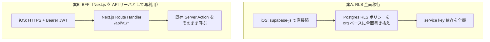

# 2. 最重要論点：認可ロジックをどこに置くか

> [← 目次に戻る](README.md)

**この判断が iOS 版の設計全体を決める。** 先に結論と根拠を書く。

## 現状の構造

現行 Web アプリは「**RLS は最終防衛線、認可はアプリ層（Server Action）で行う**」という方針（`CLAUDE.md` セキュリティ節）。実際のコードもその通りになっている：

```js
// src/app/api/supabaseFunctions/supabaseDatabase/laundryStore/action.js:20-41
export const getStores = cache(async () => {
  const { user } = await getUser();
  if (!user) return { error: { msg: "ログインしてください", status: 401 } };

  const supabase = await createClient();
  const { orgId } = await getMyOrgId(supabase, user.id);   // ← ①組織境界をアプリ層で確認
  if (!orgId) return { data: [] };

  // 組織メンバーであることを確認後、RLSを迂回して取得（閲覧者も参照可能にする）
  const serviceSupabase = createServiceClient();           // ← ②RLS を完全バイパス
  const { data, error } = await serviceSupabase
    .from("laundry_store").select("*").eq("organization_id", orgId);
  ...
});
```

コメントが明言している通り、**現行の RLS ポリシーだけでは `viewer` / `collecter` は組織の店舗を読めない**。だから `createServiceClient()`（`SUPABASE_SERVICE_KEY`）で迂回している。この構造は `collect_funds` / `laundry_state` / `organizations` の全アクションで同様。

## したがって選択肢は 2 つしかない



| 観点 | 案A: RLS 全面移行 | 案B: BFF |
|---|---|---|
| 認可ロジックの重複 | なし（DB に一元化）| なし（既存関数を再利用）|
| 初期工数 | **大**。約 7 テーブル分のポリシー再設計 + 全 Web 画面の回帰テスト | **小**。`createClient()` 1 ファイル改修 + 薄い Route Handler |
| セキュリティ事故リスク | **高**。移行途中に穴が開くと本番 Web も同時に壊れる | 低。既存の検証済みロジックを一切変えない |
| レイテンシ | 低（端末 → Supabase 直）| +1 ホップ（端末 → Vercel hnd1 → Supabase）|
| Supabase Realtime | 使える | 使えない（別途 WebSocket 設計が必要）|
| 将来の Android 版 | そのまま流用可 | そのまま流用可 |

## 結論：**案B（BFF）を採用する**

理由は 3 点。

1. **認可ロジックを二重に持たない。** 案A は「RLS 版の認可」と「Server Action 版の認可」が一時的に併存し、片方だけ直す事故が必ず起きる。本アプリは金額データを扱うため、この種の分岐は許容できない。
2. **既存の防御が一切劣化しない。** `updateData()` の「admin 以外は `collecter = 自分` に限定」のような細かい規則（`collectFunds/action.js:236-238`）を RLS に翻訳するのは可能だが、翻訳ミスの検出が難しい。
3. **レイテンシのペナルティが実質ない。** `vercel.json` は既に `"regions": ["hnd1"]`（東京）で、Supabase も同リージョン想定。1 ホップの追加は数十 ms。集金入力は 1 画面 1 送信のワークロードなので体感差は出ない。

> **将来 Realtime（他メンバーの集金をリアルタイム反映）を入れたくなった時点で、案A への移行を再検討する。** その場合も BFF は残し、読み取りだけ RLS 経由に寄せるハイブリッドが取れる。

## 案B を成立させる唯一の改修点

既存 Server Action は `getUser()` → `createClient()` 経由で **Cookie からセッションを読む**。モバイルは Cookie を持たず Bearer JWT を送る。ここだけを吸収する。

```js
// src/utils/supabase/server.js を改修（この 1 ファイルだけ）
import { createServerClient } from "@supabase/ssr";
import { createClient as createSupabaseClient } from "@supabase/supabase-js";
import { cookies, headers } from "next/headers.js";

export async function createClient() {
  // ① モバイルからの Bearer トークンを優先
  const h = await headers();
  const authz = h.get("authorization");
  if (authz?.startsWith("Bearer ")) {
    return createSupabaseClient(
      process.env.NEXT_PUBLIC_SUPABASE_URL,
      process.env.NEXT_PUBLIC_SUPABASE_ANON_KEY,
      { global: { headers: { Authorization: authz } },
        auth: { persistSession: false, autoRefreshToken: false } }
    );
  }

  // ② 従来どおり Cookie ベース（Web は完全に無変更）
  const cookieStore = await cookies();
  return createServerClient(/* ...現行のまま... */);
}
```

これだけで `getUser()`・`getMyOrgId()`・ロール判定・RLS スコープのクエリが**すべてモバイルでも同じ意味で動く**。`createServiceClient()` は元々セッション非依存なので影響なし。

- ✅ Web 側の挙動は 1 ミリも変わらない（Authorization ヘッダは飛んでこない）
- ✅ Server Action は `"use server"` の async 関数なので、Route Handler から**直接 import して呼べる**（プロセス内関数呼び出し。HTTP は経由しない）

---

**関連章**: [3. 全体アーキテクチャ](03-architecture.md) / [6. API 層設計（BFF）](06-api-bff.md) / [15. リスクと未決事項](15-risks.md)
