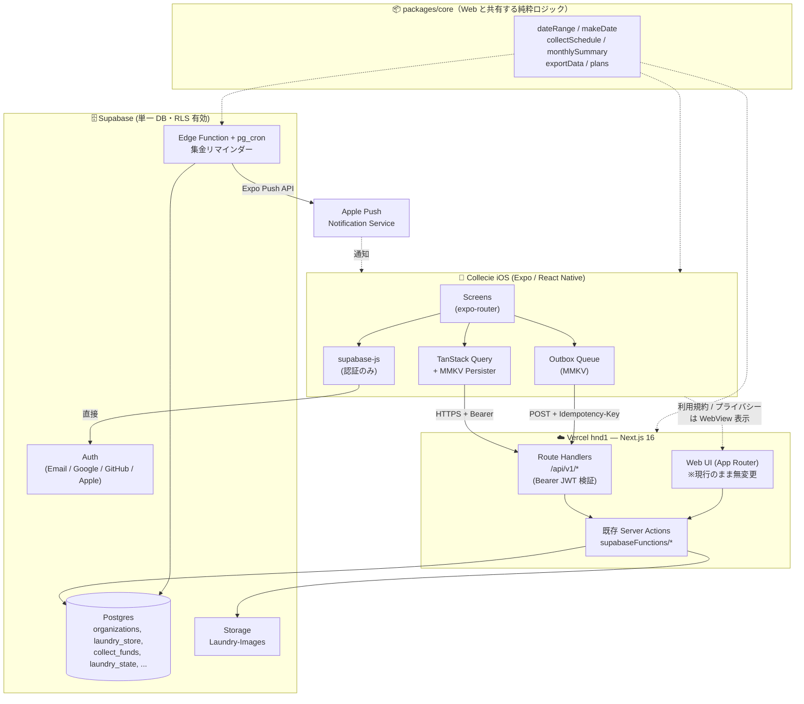

# 3. 全体アーキテクチャ

> [← 目次に戻る](README.md)

> **図中の `packages/core` は論理的な呼び名。** 2026-07-27 にモノレポ化を見送ったため、
> 物理的な正本は `coin-laundry-app/src/functions/` にある。配布方法は [4章](04-repo-structure.md) 参照。

## 各層の責務

| 層 | 責務 | 禁止事項 |
|---|---|---|
| **iOS アプリ** | 表示・入力・オフライン保持・通知受信 | 認可判定を信じない（UI 制御のためだけにロールを使う）。`SUPABASE_SERVICE_KEY` を絶対に持たない |
| **packages/core** | 日付・集計・スケジュール計算などの純粋関数 | DB / React / Node API への依存 |
| **Route Handler** | JWT 検証・入出力の JSON 整形・冪等性制御 | ビジネスロジックを書かない（Server Action に委譲）|
| **Server Action** | 認証・認可・DB 操作（**唯一の正**）| — |
| **RLS** | 最終防衛線 | ここだけに頼らない |

---

**関連章**: [2. 認可ロジックの配置](02-authz-decision.md) / [4. リポジトリ構成](04-repo-structure.md) / [6. API 層設計（BFF）](06-api-bff.md)
