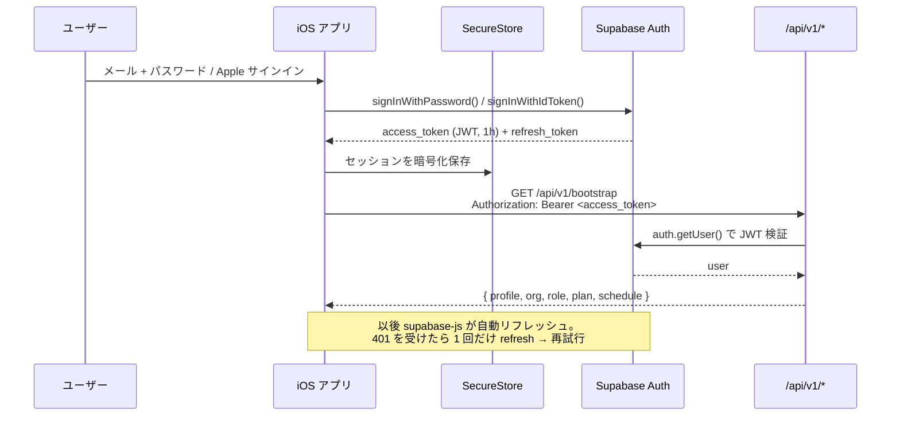
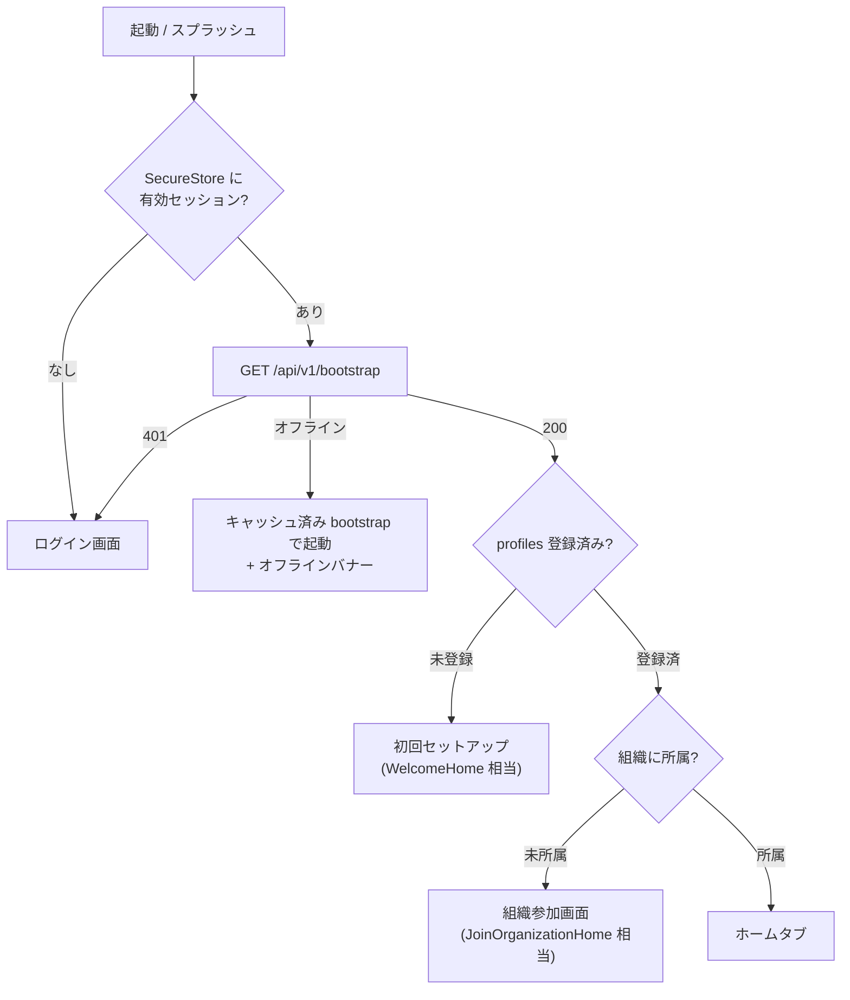

# 5. 認証・セッション設計

> [← 目次に戻る](README.md)

## 方式

**認証だけは端末から Supabase Auth へ直接**行う（BFF を挟まない）。取得した `access_token` を以降 BFF への Bearer として使う。



## 保存先の注意点

`expo-secure-store` は **1 項目あたり 2048 バイト制限**があり、Supabase のセッション JSON（access_token + refresh_token + user）は環境によりこれを超える。素直に `SecureStore` を `storage` に渡すと **サイレントに保存失敗してログアウトを繰り返す**。

対策：**チャンク分割アダプタ**を実装する。

```ts
// apps/mobile/src/api/secureStorage.ts
const CHUNK = 1800;
export const LargeSecureStore = {
  async setItem(key: string, value: string) {
    const parts = value.match(new RegExp(`.{1,${CHUNK}}`, "g")) ?? [];
    await SecureStore.setItemAsync(`${key}_n`, String(parts.length));
    await Promise.all(parts.map((p, i) => SecureStore.setItemAsync(`${key}_${i}`, p)));
  },
  async getItem(key: string) { /* _n を読んで結合 */ },
  async removeItem(key: string) { /* 全チャンク削除 */ },
};
```

```ts
createClient(URL, ANON_KEY, {
  auth: {
    storage: LargeSecureStore,
    autoRefreshToken: true,
    persistSession: true,
    detectSessionInUrl: false,   // ← RN では必ず false
  },
});
```

さらに `AppState` の `active` / `background` で `supabase.auth.startAutoRefresh()` / `stopAutoRefresh()` を切り替える（バックグラウンドでの無駄なリフレッシュを防ぐ）。

## サインイン手段

| 手段 | 実装 | 備考 |
|---|---|---|
| メール + パスワード | `signInWithPassword` | Web と同じバリデーション（8文字以上・英数字混在）を `packages/core` に切り出して共有 |
| **Sign in with Apple** | `expo-apple-authentication` → `signInWithIdToken({ provider: "apple" })` | **App Store 審査で必須**（[13章 App Store 審査対応](13-app-review.md)）|
| Google | `expo-auth-session` → `signInWithIdToken({ provider: "google" })` | ネイティブフローを使う。`signInWithOAuth` + WebView は審査で嫌われる |
| GitHub | v1 では非対応 | 現場ユーザー層で利用が薄いため。Web には残す |
| パスワードリセット | `resetPasswordForEmail` + Universal Links | `collecie://auth/reset` ではなく Universal Link 推奨 |

## 起動時フロー



分岐条件は現行 `src/app/page.js:110-124` の判定ロジックと 1 対 1 で対応させる。

---

**関連章**: [6. API 層設計（BFF）](06-api-bff.md) / [7. 画面設計](07-screens.md) / [13. App Store 審査対応](13-app-review.md)
