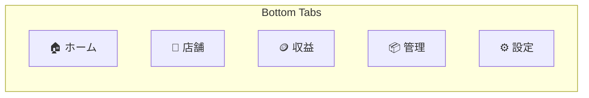

# 7. 画面設計

> [← 目次に戻る](README.md)

**この章の構成**

- [7.1 ナビゲーション](#71-ナビゲーション)
- [7.2 ルート構成（expo-router）](#72-ルート構成expo-router)
- [7.3 画面別マッピングと変更点](#73-画面別マッピングと変更点)
- [7.4 集金入力画面](#74-集金入力画面)

## 7.1 ナビゲーション

現行の `FooterNavbar`（`ALL_NAV_ITEMS`）と同一のタブ構成にする。Web とアプリで「同じ場所に同じものがある」状態を保つため。



組織未所属ユーザーは `RESTRICTED_NAV_ITEMS` と同じく **ホーム / 設定の 2 タブのみ**表示（`FooterNavber.jsx` の `hasOrg` 分岐に対応）。

## 7.2 ルート構成（expo-router）

```
app/
├── _layout.tsx                       # Providers（Query, Theme, Auth, Outbox）
├── (auth)/
│   ├── login.tsx
│   ├── signup.tsx
│   ├── forgot-password.tsx
│   └── setup.tsx                     # 初回プロフィール登録（WelcomeHome 相当）
├── (app)/
│   ├── _layout.tsx                   # Tabs
│   ├── index.tsx                     # 🏠 ホーム
│   ├── stores/
│   │   ├── index.tsx                 # 🧺 店舗一覧
│   │   ├── new.tsx                   # 🔒 店舗登録
│   │   └── [id]/
│   │       ├── index.tsx             # 店舗詳細
│   │       ├── edit.tsx              # 🔒 店舗編集
│   │       └── history.tsx           # 売上履歴 + グラフ
│   ├── revenue/
│   │   └── index.tsx                 # 🪙 収益（org 全体）
│   ├── manage/
│   │   └── index.tsx                 # 📦 在庫 / 設備（セグメント切替）
│   └── settings/
│       ├── index.tsx                 # ⚙️ 設定
│       ├── account.tsx
│       ├── organization.tsx          # 🔒 メンバー・招待・参加パスワード
│       ├── collect-schedule.tsx      # 🔒
│       ├── notifications.tsx         # ★アプリ固有：通知設定
│       ├── plan.tsx                  # read-only
│       ├── log.tsx
│       └── webview.tsx               # 利用規約 / プライバシー / 特商法
└── collect/
    └── [storeId].tsx                 # 💰 集金入力（フルスクリーンモーダル）
```

## 7.3 画面別マッピングと変更点

| iOS 画面 | 対応する Web | 主な差分 |
|---|---|---|
| ホーム | `LoginUserHome` | Pull-to-refresh 追加。集金カウントダウンをヘッダ常設。オフライン時はキャッシュ表示 + バナー |
| 店舗一覧 | `/coinLaundry` | 画像カルーセルは `expo-image` + `FlashList` |
| 店舗詳細 | `/coinLaundry/[id]` | 電話・地図アプリ起動（`Linking`）を追加 |
| 売上履歴 | `/coinLaundry/[id]/coinDataList` | 無限スクロール（`useInfiniteQuery`）。テーブルは `FlashList` |
| 収益 | `/collectMoney` | 期間セグメント + 店舗別累計 + 月次サマリー。エクスポートは v1.1 |
| 管理 | `/inventory` + `/equipment` | Web では 2 ページだが、Footer 上は同じ「管理」タブ。**アプリではセグメントコントロールで統合**（`isActive` が両方を同一タブ扱いしている現行仕様に合わせる）|
| **集金入力** | `/collectMoney/[id]/newData` | **最も作り込む画面**。[7.4](#74-集金入力画面) 参照 |
| 設定 | `/settings` | プランカードは read-only。「その他」に規約類（WebView）|

## 7.4 集金入力画面

現場での実使用が集中する画面。ネイティブの利点をここに全振りする。

```
┌─────────────────────────────────┐
│ ✕            ○○店            ⋯ │  ヘッダ（店舗切替可）
├─────────────────────────────────┤
│ 📅 集金日      2026/07/27    ▾ │  ネイティブ DatePicker（JST 0時に正規化）
├─────────────────────────────────┤
│ 集金方式   [ 機種別 | 合計 ]     │  profiles.collectMethod を初期値に
├─────────────────────────────────┤
│ 洗濯機A          [    12 ]枚  ⚖ │  ← ⚖ タップで重量入力に切替
│ 乾燥機B          [     8 ]枚    │    （weight / 4.8g で枚数換算）
│ 両替機           [     0 ]枚    │
│                              ＋ │
├─────────────────────────────────┤
│         合計   ¥ 2,000          │  Space Mono・リアルタイム更新
│  [ 一時保存 ]      [  登録  ]   │  Safe Area 内に固定
└─────────────────────────────────┘
```

**設計上の要点**

- **カスタム数値キーパッド**を自前で持つ。iOS 標準テンキーは小数点・記号が混ざり、グローブ操作で誤爆する。0-9 / ⌫ / 次へ の 12 キーに絞り、キー高さ 56pt 以上。
- 入力ごとに `Haptics.selectionAsync()`。登録成功で `notificationAsync(Success)`。
- **合計金額の計算式は現行と完全一致させる**：`fundsArray` の `funds`（＝枚数）合計 × 100。重量入力時は `Math.ceil(weight / 4.8)`。この定数（`coinWeight = 4.8`）は `packages/core` に移して共有する。
- 画面を開いた瞬間に `client_request_id`（uuid v4）を発行し、下書きと一緒に保持する。
- 下書きは**自動保存**（現行は「一時保存」ボタン手動）。入力変化から 1.5 秒の debounce で MMKV へ。アプリが落ちても復元できる。
- 送信は必ず Outbox 経由。オンラインなら即時 flush、圏外ならキューに積んで「未送信 1 件」バッジを出す。

---

**関連章**: [9. オフライン設計](09-offline.md) / [11. デザインシステムの移植](11-design-system.md) / [6.4 冪等性の設計](06-api-bff.md#64-冪等性の設計)
