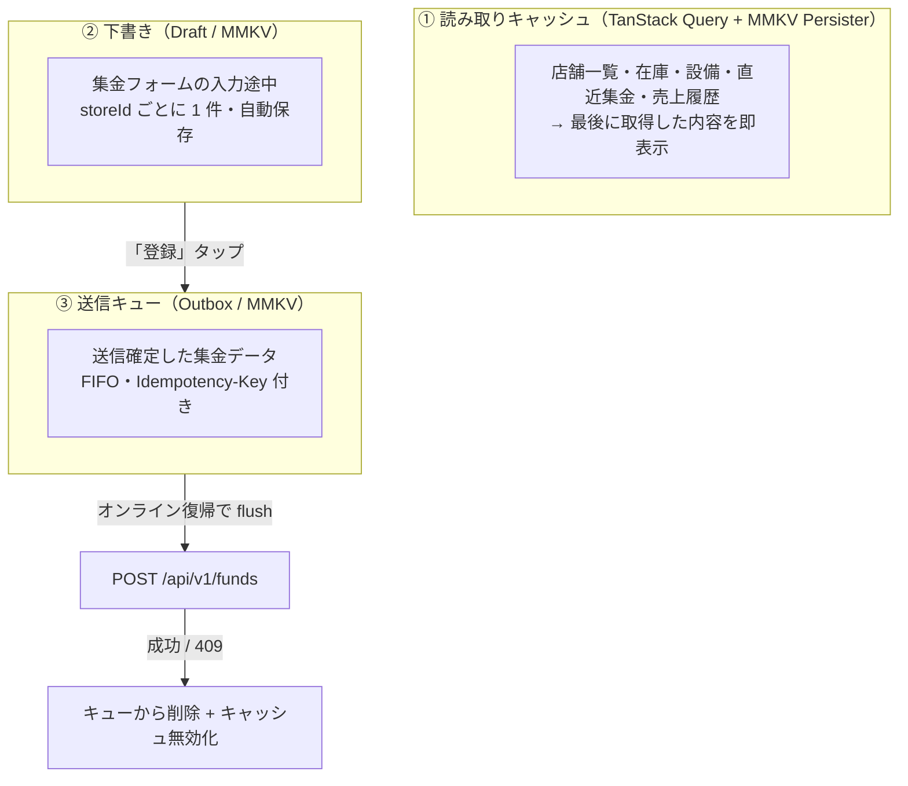

# 9. オフライン設計

> [← 目次に戻る](README.md)

## 9.1 3 層構造

## 9.2 Outbox の仕様

| 項目 | 仕様 |
|---|---|
| 保存先 | `react-native-mmkv`（同期 API・高速。JSON 配列 1 キー）|
| 順序 | FIFO。1 件ずつ直列に送る（並列にすると失敗時の状態が読めない）|
| 再送 | 指数バックオフ（2s → 4s → 8s → 30s 上限）。最大 24 時間 |
| トリガ | ①アプリ復帰（`AppState → active`）②ネット復帰（`NetInfo`）③手動プル |
| 失敗の扱い | `4xx`（409 除く）は**リトライしない**。「送信できませんでした」として UI に残し、ユーザーが編集 or 破棄できるようにする |
| 上限 | 50 件。超えたら新規入力をブロックし「未送信データを送信してください」を表示 |
| 可視化 | ホームと集金タブに `未送信 N 件` バッジ。タップで一覧 → 個別に再送 / 破棄 |

**やらないこと**：ローカル SQLite への完全ミラーリングと双方向同期。集金業務は「入力は自分の端末・閲覧は最新」で足り、コンフリクト解決の複雑さに見合わない。

## 9.3 オフライン時の UI ルール

- 読み取りはキャッシュを出し、画面上部に細いバナー `オフライン — 最終更新 7/27 14:32`
- 書き込み系ボタンのうち、**集金登録だけは押せる**（Outbox がある）。それ以外（店舗編集・メンバー管理など）はキュー対象外なので無効化し「オフラインでは変更できません」を表示
- 在庫更新（`updateStockState`）は Outbox 対象に含めるか要検討 → **v1 では対象外**。理由は last-write-wins で他メンバーの更新を巻き戻すリスクがあるため

---

**関連章**: [6.4 冪等性の設計](06-api-bff.md#64-冪等性の設計) / [7.4 集金入力画面](07-screens.md#74-集金入力画面) / [15. リスクと未決事項](15-risks.md)
