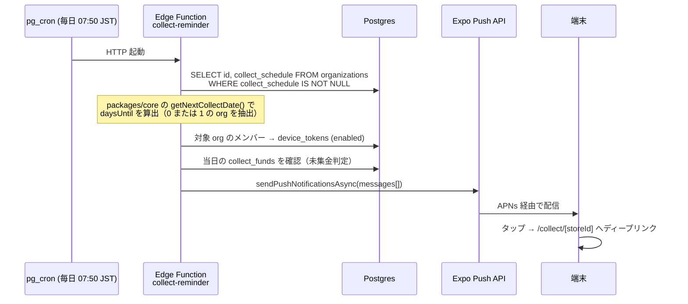

# 10. プッシュ通知設計

> [← 目次に戻る](README.md)

`今後の実装予定 3・5`（集金サイクル管理の未集金アラート・リマインダー）を、ネイティブ化の目玉としてここで実装する。

## 10.1 構成

## 10.2 通知の種類

| 種類 | トリガ | 文面例 | 設定キー |
|---|---|---|---|
| 集金前日リマインダー | `daysUntil === 1` | 「明日は集金日です（○○店ほか 3 店舗）」 | `collectReminder` |
| 当日リマインダー | `daysUntil === 0` かつ当日の `collect_funds` が 0 件 | 「今日は集金日です。まだ登録がありません」 | `collectReminder` |
| 低在庫アラート | `getStockStates().lowStockItems` が増えた時 | 「○○店の洗剤が残り 1 です」 | `lowStock` |
| 機器故障アラート | `machines[].break` が false → true | 「○○店の乾燥機Bが故障として登録されました」 | `machineBreak` |
| 未送信データ督促 | ローカル通知（サーバ不要）| 「未送信の集金データが 2 件あります」 | — |

## 10.3 実装メモ

- `getNextCollectDate()` は**すでに純粋関数として存在する**（`src/functions/collectSchedule.js`）。Edge Function は Deno だが、`packages/core` の ESM をそのまま import できる。ロジックの二重実装を避けられる。
- 通知の送信可否は `profiles.notification_prefs` を見る。オフにしているユーザーはクエリ段階で除外。
- Expo Push Token は `DeviceEventEmitter` ではなく `Notifications.getExpoPushTokenAsync()` で取得し、`POST /api/v1/devices` に登録。ログアウト時は `DELETE /api/v1/devices/:token`。
- **通知許可のリクエストタイミング**：起動直後に出さない。初回の集金登録完了直後に「集金日をお知らせしますか？」というアプリ内プライミング画面を挟んでから OS ダイアログを出す（許諾率が大きく変わる）。
- 送信失敗トークン（`DeviceNotRegistered`）は `device_tokens.enabled = false` に落とす。

---

**関連章**: [8.2 追加スキーマ](08-data-model.md#82-追加スキーマ3-点のみ) / [6.3 エンドポイント一覧](06-api-bff.md#63-エンドポイント一覧) / [14. 実装フェーズ](14-phases.md)
